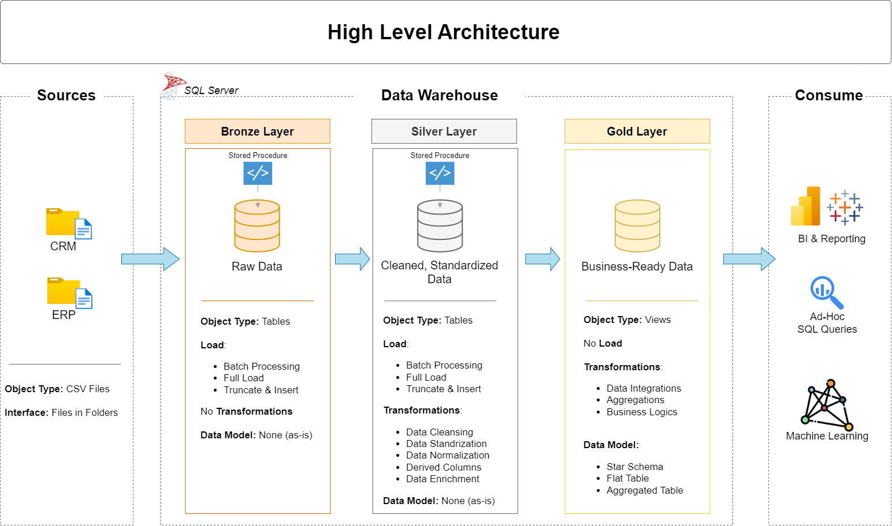

# SQL Data Warehouse and Analytics Project

Welcome to my SQL Data Warehouse Project!

This project demonstrates the complete process of building a modern data warehouse using SQL Server. It includes data ingestion, ETL pipelines, data modeling, and analytical reporting following the Medallion Architecture (Bronze, Silver, Gold).

The project is part of my data engineering portfolio and showcases practical SQL development skills.

---
## 🏗️ Data Architecture

The data architecture for this project follows Medallion Architecture **Bronze**, **Silver**, and **Gold** layers:


1. **Bronze Layer**: Stores raw data as-is from the source systems. Data is ingested from CSV Files into SQL Server Database.
2. **Silver Layer**: This layer includes data cleansing, standardization, and normalization processes to prepare data for analysis.
3. **Gold Layer**: Houses business-ready data modeled into a star schema required for reporting and analytics.

---
## 📖 Project Overview

This project involves:

1. **Data Architecture**: Designing a Modern Data Warehouse Using Medallion Architecture **Bronze**, **Silver**, and **Gold** layers.
2. **ETL Pipelines**: Extracting, transforming, and loading data from source systems into the warehouse.
3. **Data Modeling**: Developing fact and dimension tables optimized for analytical queries.
4. **Analytics & Reporting**: Creating SQL-based reports and dashboards for actionable insights. 

---

## 🛠️ Tech Stack

- SQL Server 2025 Express
- SQL Server Management Studio (SSMS)
- Git & GitHub
- Draw.io
- CSV Files
- Notion

---

## 🛠️ Skills Demonstrated

- SQL
- ETL Pipeline Development
- Data Warehousing
- Medallion Architecture
- Data Cleaning & Transformation
- Star Schema Modeling
- Analytical SQL Queries

---

## 🚀 Project Requirements

### Building the Data Warehouse (Data Engineering)

#### Objective
Develop a modern data warehouse using SQL Server to consolidate sales data, enabling analytical reporting and informed decision-making.

#### Specifications
- **Data Sources**: Import data from two source systems (ERP and CRM) provided as CSV files.
- **Data Quality**: Cleanse and resolve data quality issues prior to analysis.
- **Integration**: Combine both sources into a single, user-friendly data model designed for analytical queries.
- **Scope**: Focus on the latest dataset only; historization of data is not required.
- **Documentation**: Provide clear documentation of the data model to support both business stakeholders and analytics teams.

---

### BI: Analytics & Reporting (Data Analysis)

#### Objective
Develop SQL-based analytics to deliver detailed insights into:
- **Customer Behavior**
- **Product Performance**
- **Sales Trends**

These insights empower stakeholders with key business metrics, enabling strategic decision-making.  


## 📂 Repository Structure
```
data-warehouse-project/
│
├── datasets/                           # Raw datasets used for the project (ERP and CRM data)
│
├── docs/                               # Project documentation and architecture details
│   ├── etl.png                         # .png file shows all different techniques and methods of ETL
│   ├── data_architecture.png           # .png file shows the project's architecture
│   ├── data_catalog.md                 # Catalog of datasets, including field descriptions and metadata
│   ├── data_flow.png                   # .png file for the data flow diagram
│   ├── data_model.png                  # .png file for data models (star schema)
│   ├── naming-conventions.md           # Consistent naming guidelines for tables, columns, and files
│
├── scripts/                            # SQL scripts for ETL and transformations
│   ├── bronze/                         # Scripts for extracting and loading raw data
│   ├── silver/                         # Scripts for cleaning and transforming data
│   ├── gold/                           # Scripts for creating analytical models
│
├── tests/                              # Test scripts and quality files
│
├── README.md                           # Project overview and instructions
├── LICENSE                             # License information for the repository
├── .gitignore                          # Files and directories to be ignored by Git
```
---

## 🛡️ License

This project is licensed under the [MIT License](LICENSE). You are free to use, modify, and share this project with proper attribution.

---


## 👩‍💻 About Me

Hi! I'm Neha, an IT undergraduate passionate about solving problems with data. This repository contains my SQL Server project, documenting the complete development process from database design to implementation.

---

### 🌐 Connect with Me

[](https://github.com/n3h4a)
[](https://www.linkedin.com/in/nehakaramchandani/)
